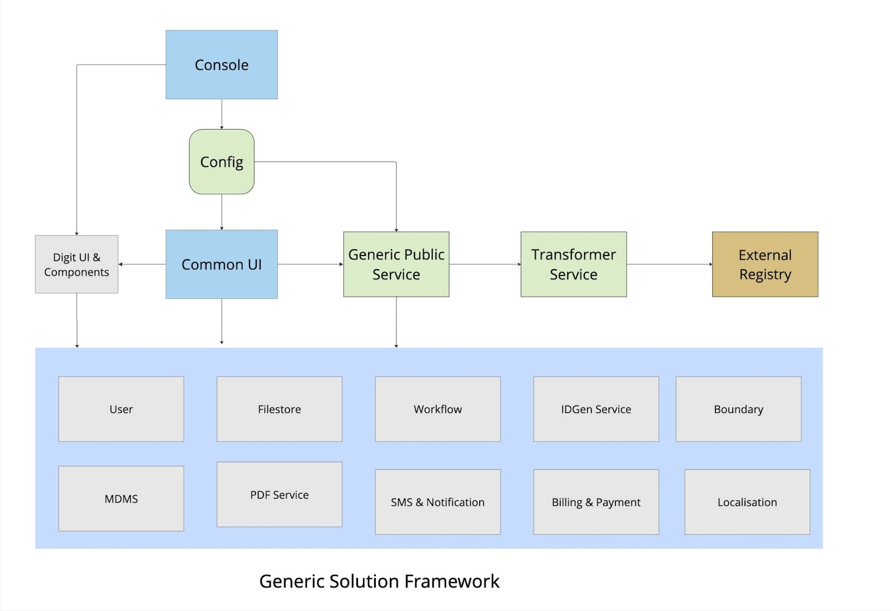

# Design Architecture

## System Architecture Overview

The system follows a modular, service-oriented architecture designed to:\
✔ Streamline frontend interactions with a unified API layer.\
✔ Optimise backend communication by reducing direct dependencies.\
✔ Ensure extensibility through configuration-driven service creation.

<figure><figcaption></figcaption></figure>

## Common Services

### 1. Generic Service (Orchestrator)

* Acts as the central entry point for all frontend interactions.
* Manages request routing, validation, and response aggregation across core services.
* Reduces direct dependencies on multiple backend services, ensuring a simplified API layer.
* Supports dynamic module creation through configuration, enabling flexible service activation.
* Initialises required data for dependent core services to ensure seamless integration.
* Provides a default calculator for simple use cases.

#### Core Services Integrated with the Orchestrator

✅ MDMS (Master Data Management System)\
✅ Individual Service\
✅ Workflow Service\
✅ PDF Generation Service\
✅ SMS & Notification Service\
✅ Localisation Service\
✅ File Storage (Filestore) Service\
✅ Boundary Service\
✅ ID Generation Service\
✅ Authorisation Service\
✅ Billing & Payment Service

### 2. Application Service

* Manages business logic and orchestrates workflows based on workflow configurations.
* Provides APIs for frontend interactions and internal service communication.
* Supports modular and extensible service development, minimizing code modifications.
* Handles dynamic field management, adapting to specific use cases via configuration.
* Can be extended to support new urban governance modules without additional development.

### 3. Transformer Service (Planned for Future Release)

* Processes and structures data from various sources by:\
  🔹 Adding approved, validated data to the registry.\
  🔹 Retrieving structured data as needed.\
  🔹 Normalising and transforming data formats for consistency.
* Reduces transformation logic in the Generic or Application Service, improving maintainability.
* Uses a configuration-driven approach to define transformation rules dynamically.
* Will function based on configurations for data fetching and transferring.
* This service is planned for a future release and may not be available in the first beta version.

### 4. Record/Registry Service

* Acts as a persistent data layer, reducing redundant API calls and improving efficiency.
* Once an application is approved, it is stored in the registry as a validated record.
* Supports triggering new transactions based on stored records.
* If an external registry is available, data can be pushed to it.
* If no external registry is required, this service serves as the default registry for the application

### 5. Generic UI

* A configuration-driven UI that dynamically adapts based on service configurations.
* Supports dynamic forms, workflows, and screens, tailored to specific service needs.
* Enables a seamless flow from service application to approval and tracking.

### 6. Console (Planned for Future Release)

* A low-code/no-code platform for dynamically configuring and modifying services.
* Enables users to create, initialise, and manage services with minimal development effort.
* Facilitates rapid deployment and customisation of services.
* Should include separate configurators for localisation message handling, workflows, SMS, and MDMS data.
* Currently, the console is focused solely on service enablement. Handling of localisation, workflows, SMS, and MDMS may be integrated in future updates.
* Integration of multiple modules - for example, property being referenced in the business license module.

<figure><figcaption></figcaption></figure>

\
